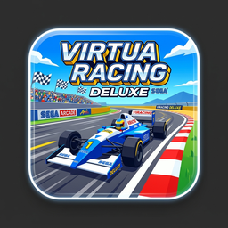

# Virtua Racing Deluxe — Nintendo Switch Port

Standalone native Nintendo Switch homebrew port of **Virtua Racing Deluxe (Sega 32X)**, running the optimized disassembly & camera-interpolated engine by Matias Zanolli.



---

## 🏎️ Features

- **Smooth 60 Hz Presentation & Zero Slowdown**: 
  - Dual Hitachi SH-2 cycle multiplier (Stock 1.0x, Smooth 1.5x, Ultra 2.0x, Turbo 3.0x) completely eliminates the stock 32X polygon slowdown in car select and dense competitor packs.
- **In-Game Settings Overlay (Press Minus `-`)**:
  - Full-featured configuration menu accessible anytime during gameplay with zero external font dependencies.
  - Automatically pauses emulation and audio cleanly.
  - Persistent settings saved directly to `sdmc:/switch/virtuaracing32x/config.ini`.
- **Multiple Screen Ratios & 16:9 Viewport Edge Blending**:
  - **Pixel-Perfect 3x Integer Scaling**: 960x672 razor-sharp 1:1 pixel grid with authentic dark pillarboxes.
  - **Clean 4:3**: Centered 960x720 pillarboxed display.
  - **True 16:9 (Widescreen)**: 1280x720 with selectable edge blending:
    - *Soft Feather*: Smooth 16-pixel alpha transition across viewport boundaries.
    - *Subtle Vignette*: Perimeter shadow falloff.
    - *Dark Pillars*: High-contrast arcade border shading.
    - *None*: Raw edge rendering.
  - **Stretched 16:9**: Anamorphic 1280x720 fullscreen.
  - Quick aspect ratio cycling via **L3** or **R3** analog stick clicks.
- **Built-In Cheats Engine**:
  - **Infinite Race Time**: Freezes race countdown timer at 99s.
  - **Super Turbo Speed**: Blast past normal vehicle top speed limits (up to 330+ km/h) with tire particle trail.
  - **Freeze AI Racers**: Zeroes velocity vectors across all AI competitor cars for carefree cruising.
- **Real-Time Performance OSD**:
  - On-screen HUD displaying real-time display refresh rate (`FPS`) and pure emulation calculation frame time (`Emu: X.X ms`).
- **High-Fidelity Audio**:
  - 44.1 kHz stereo audio featuring YM2612 FM synthesis, SN76489 PSG sound effects, and 32X PWM digitized voice/engine samples.
- **Battery-Backed Save State (SRAM)**:
  - High scores, lap records, and championship rankings automatically save to `sdmc:/switch/virtuaracing32x/save/vrd.srm`.
- **2-Player Split Screen Multiplayer**:
  - Full support for two connected Joy-Cons or Nintendo Switch Pro Controllers for head-to-head racing.
- **Clean Legal Homebrew**:
  - The `.nro` binary contains **zero** copyrighted assets or ROM data.
  - Users provide their own legal copy of Virtua Racing Deluxe (`vr_rebuild.32x` or `rom.bin`) on their SD card.

---

## 🕹️ Controls (Nintendo Switch Default Mapping)

| Switch Button | 32X Action | Notes |
| :--- | :--- | :--- |
| **Left Stick / D-Pad** | Steering / Up / Down / Left / Right | Smooth analog steering with deadzone filtering |
| **B (South) / ZR Trigger** | Button B | **Accelerate** |
| **Y (West) / ZL Trigger** | Button A | **Brake** |
| **A (East)** | Button C | **Accelerate / Shift Up** |
| **X (North)** | Button X | **Camera View 1** (In-car / Cockpit) |
| **L (Left Bumper)** | Button Y | **Camera View 2** (Low Chase / Behind) |
| **R (Right Bumper)** | Button Z | **Camera View 3** (High Chase / Helicopter) |
| **Plus (+)** | Start | **Start / Pause Game** |
| **Minus (-)** | Menu / Mode | **Open In-Game Settings Overlay** |
| **L3 / R3 (Stick Clicks)** | Aspect Ratio Toggle | Quick cycle aspect ratio mode |
| **Plus (+) + Minus (-)** | Exit | Instant exit to Homebrew Menu |

### Overlay Menu Controls
- **D-Pad / Left Stick:** Navigate menu options
- **(A) or D-Pad Left / Right:** Adjust option value
- **(B) or Minus (-):** Close menu and resume race

---

## 📦 Installation & ROM Setup

1. Download `VirtuaRacingDeluxe.nro` (or extract `VirtuaRacingDeluxe-v1.0.0-switch.zip`).
2. Copy `VirtuaRacingDeluxe.nro` to `sdmc:/switch/` or `sdmc:/switch/virtuaracing32x/` on your SD card.
3. Place your Virtua Racing Deluxe (Sega 32X) ROM file (`vr_rebuild.32x` or `rom.bin`) inside:
   ```
   sdmc:/switch/virtuaracing32x/vr_rebuild.32x
   ```
   *(Also accepts `rom.bin` or `Virtua Racing Deluxe (USA).32x` directly in `sdmc:/switch/virtuaracing32x/` or `sdmc:/switch/virtuaracing32x/Game/`)*
4. Launch the Homebrew Menu on your Switch (via Title Override for full RAM access) and select **Virtua Racing Deluxe**.

### 🔍 Verified ROM Checksums

| ROM Version | File Name | Size | SHA-1 | MD5 |
| :--- | :--- | :--- | :--- | :--- |
| **Retail Cartridge Dump (USA)** | `Virtua Racing Deluxe (USA).32x` | 3,145,728 bytes | `18dfdeb50780c2623e60a6587d7ed701a1cf81f1` | `72b1ad0f949f68da7d0a6339ecd51a3f` |
| **Disassembly Rebuild (Optimized)** | `vr_rebuild.32x` | 4,194,304 bytes | `7a46af8e6c93dd029075a373fda14fc2ac073587` | `3dcd627bcf1c85d8579707d2d1f5367d` |

---

## 🛠️ Building from Source

### 1. Build the Sega 32X ROM from Disassembly
```bash
make all
```
Produces `build/vr_rebuild.32x`.

### 2. Compile and Package the Switch NRO
```bash
cmake -S platforms/switch -B platforms/switch/build_switch -G Ninja \
  -DCMAKE_TOOLCHAIN_FILE=/opt/devkitpro/cmake/Switch.cmake \
  -DCMAKE_BUILD_TYPE=Release

cmake --build platforms/switch/build_switch
```
The output `.nro` will be generated at `platforms/switch/build_switch/VirtuaRacingDeluxe.nro`.
